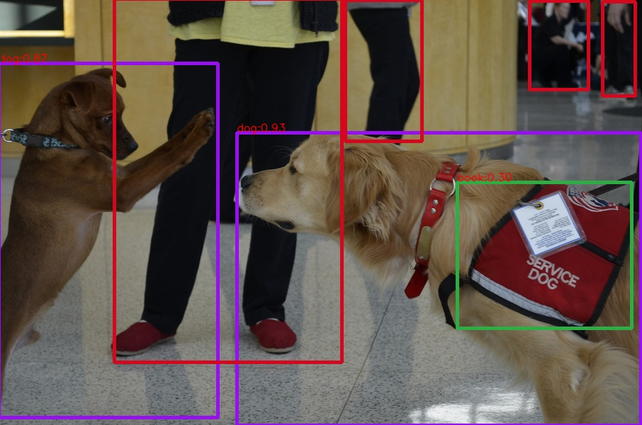
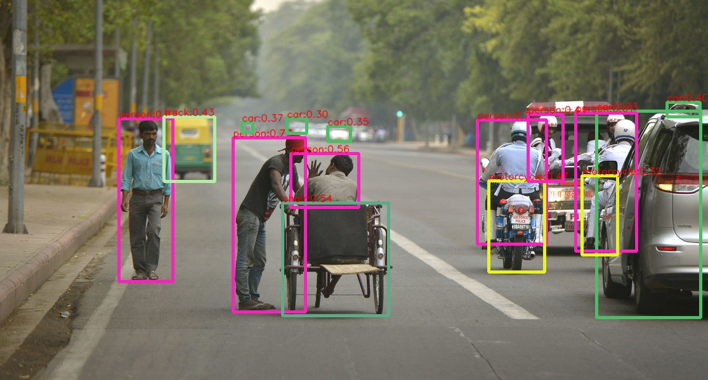
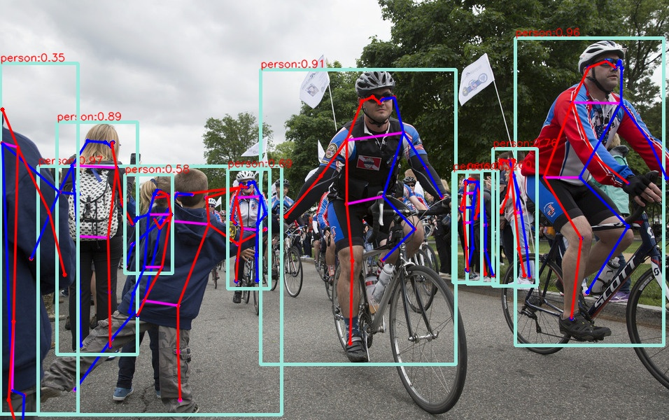
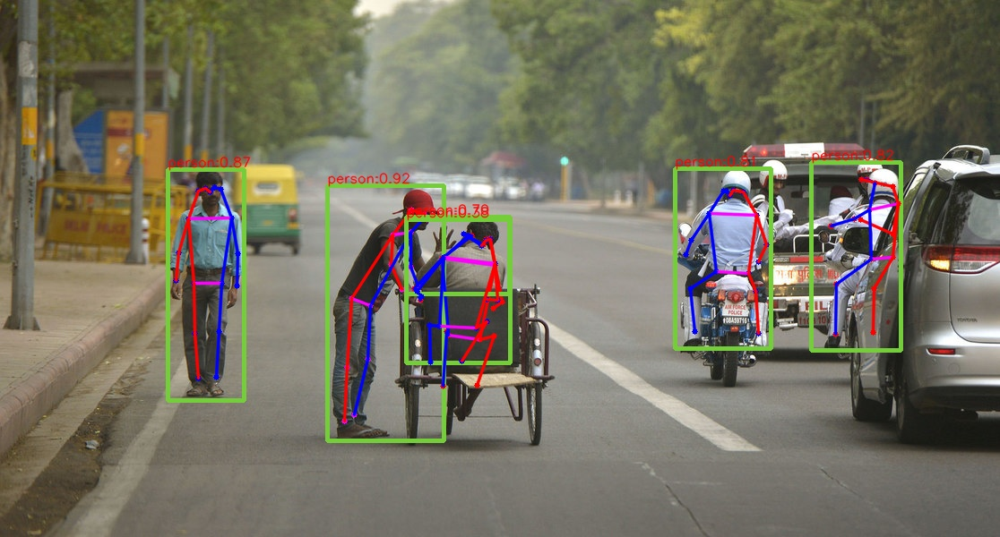

This is a C++ implementation of CenterNet using TensorRT and CUDA. Thanks for the official implementation of [CenterNet (Objects as Points)](https://github.com/xingyizhou/CenterNet)!

<p align="center">
 
 
</p>

<p align="center">
 
 
</p>


# Dependencies:
- Ubuntu 16.04
- PyTorch 1.2.0 (for the compatibility of TensorRT 5 in Jetson Tx2)
- CUDA 10.0 [required]
- TensorRT-7.0.0.11 (for CUDA10.0) [required]
- CUDNN (for CUDA10.0, may not be used) [required]
- libtorch (torch c++ lib of cpu version, gpu version may conflict with the environment) [optional]
- gtest (Google C++ testing framework) [optional]

note that 
- The TensorRT library must be consistent with the installed CUDA and CUDNN
- TensorRT 5 does not support dynamic shape
- TensorRT 7.0.x does not directly support the Int8 calibration with dynamic shape
- TensorRT 7.1.x supports the Int8 calibration with dynamic shape

# Plugins of TensorRT:
- MyUpsampling: F.interpolate/ nn.nn.UpsamplingBilinear2d
- DCN: deformable CNN


# PyTorch to onnx 
Clone the repo [CenterNet (Objects as Points)](https://github.com/xingyizhou/CenterNet) and download the models, then modify the backbone's outputs from 
```
return [ret]
```
to 
```
if self.training:                                                                                                           
    return [ret]                                                                                                             
else:                                                                                                                       
    hm = ret['hm'].sigmoid_()                                                                                               
    hmax = nn.functional.max_pool2d(hm, (3, 3), stride=1, padding=1)                                                         
    keep = (hmax == hm).float()                                                                                             
    hm = hm * keep                                                                                                                   
    if len(self.heads) == 3: # 2D object detection                                                                           
        return hm, ret['wh'], ret['reg']                                                                                              
    elif len(self.heads) == 6: # multi_pose                                                                                 
        wh, reg, hm_hp, hps, hp_offset = ret['wh'], ret['reg'], ret['hm_hp'], ret['hps'], ret['hp_offset']                            
        hm_hp = hm_hp.sigmoid_()                                                                                             
        hm_hp_max = nn.functional.max_pool2d(hm_hp, (3, 3), stride=1, padding=1)                                            
        keep = (hm_hp_max == hm_hp).float()                                                                                
        hm_hp = hm_hp * keep                                                                                                          
        return hm, wh, reg, hps, hm_hp, hp_offset                                                                            
    else:                                                                                                                   
        #TODO                                                                                                               
        raise Exception("Not implemented!")  
```
For 2D object detection, modify the  function `process`  in `src/lib/detectors/ctdet.py`:
```
with torch.no_grad():
    hm, wh, reg = self.model(images)

    torch.onnx.export(self.model, images, "ctdet-resdcn18.onnx", opset_version=9, verbose=False, output_names=["hm", "wh", "reg"])
    quit()
```
For human pose estimation, modify the function `process` in `src/lib/detectors/multi_pose.py`:
```
       hm, wh, reg, hps, hm_hp, hp_offset = self.model(images)                                                               
       names=['hm', 'wh', 'reg', 'hps', 'hm_hp', 'hp_offset']                                                               
       torch.onnx.export(self.model, images, "pose.onnx", opset_version=9, \                                                 
                         verbose=False, input_names=["input"], output_names=names)  
```

and replace the `CenterNet/src/lib/models/networks/DCNv2` with `plugins_py/DCNv2`.

To obtain the onnx file, run the command:
```
 cd CenterNet/src &&\
 python3 demo.py ctdet --arch resdcn_18 --demo xxxxx.jpg --load_model ../models/ctdet_coco_resdcn18.pth --debug 4 --exp_id 1
```


# Build & Run:

1. build the  plugins of TensorRT:
```
cd onnx-tensorrt/plugin/build &&\
cmake .. &&\
make -j
```
you may need to explicitly specifiy the path of some libraries. To varify the correctness of plugins, set `Debug` mode and build with `GTEST` in `plugin/CMakeLists.txt`.

2. build the `onnx-tensorrt` with this command:
```
cd onnx-tensorrt/build &&\
cmake .. &\
make -j
```
After successfully building the tool, we can convert the `xxx.onnx` file to serialized TensorRT engine `xxxx.trt`:
```
cd onnx-tensorrt &&\
./build/onnx2trt ctdet-resdcn18.onnx -d 16 -o ~/ctdet-resdcn18-fp16.trt
```

3. build the inference code:
```
cd centernet-tensorrt/build &&\
cmake .. &&\
make -j
```
then, run this command to see the detection's result:
```
./build/ctdet_infer -g=0 -e=ctdet-resdcn18-fp16.trt -i=data.txt -o=det_res
```

For pose estimation, run the command:
```
./build/pose_infer -g=0 -e=xxxxx.trt -i=data.txt -o=pos_res
```

# Analysis
1. inference speed:

#TODO


