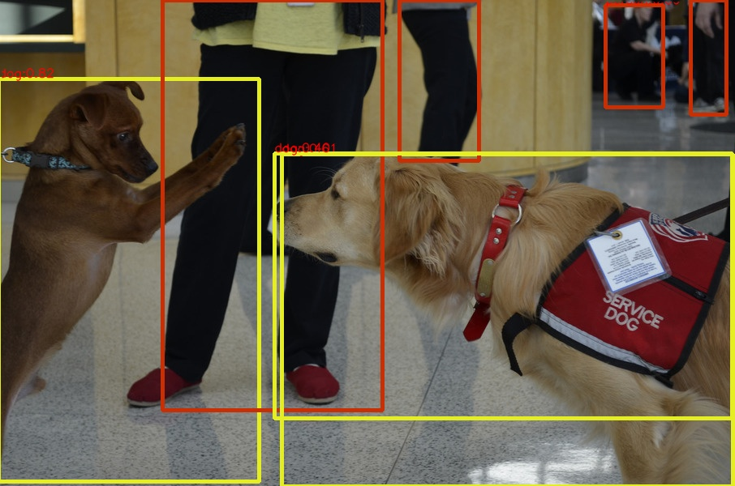
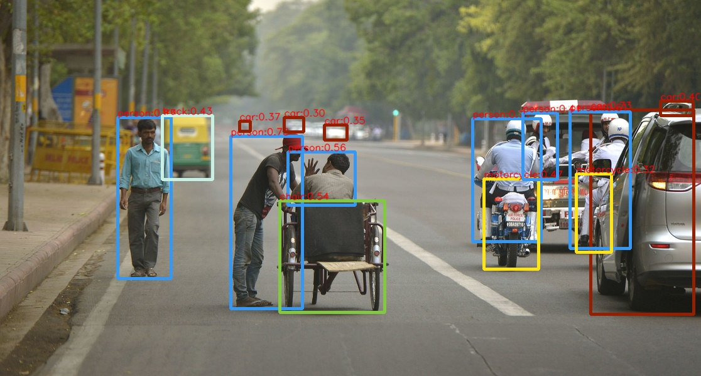

This is a C++ implementation of CenterNet using TensorRT and CUDA. Thanks for the official implementation of [CenterNet (Objects as Points)](https://github.com/xingyizhou/CenterNet)!





# Dependencies:
- Ubuntu 16.04
- CUDA 10.0 [required]
- TensorRT-7.0.0.11 (for CUDA10.0) [required]
- CUDNN (for CUDA10.0, may not be used) [required]
- libtorch (torch c++ lib of cpu version, gpu version may conflict with the environment) [optional]
- gtest (Google C++ testing framework) [optional]


# Plugins of TensorRT:
- MyUpsampling: F.interpolate/ nn.nn.UpsamplingBilinear2d
- DCN: deformable CNN

# PyTorch to onnx 
Clone the repo [CenterNet (Objects as Points)](https://github.com/xingyizhou/CenterNet) and download the models, then modify the backbone's outputs from 
```
return [ret]
```
to 
```
if self.training:
return [ret]
else:
hm = ret['hm'].sigmoid_()

hmax = nn.functional.max_pool2d(hm, (3, 3), stride=1, padding=1)
keep = (hmax == hm).float()
hm = hm * keep

return hm, ret['wh'], ret['reg']
```
modify the  function `process`  in `src/lib/detectors/ctdet.py`:
```
with torch.no_grad():
hm, wh, reg = self.model(images)

torch.onnx.export(self.model, images, "ctdet-resdcn18.onnx", opset_version=9, verbose=False, output_names=["hm", "wh", "reg"])
quit()
```
to obtain the onnx file, run the command:
```
 cd CenterNet/src &&\
 python3 demo.py ctdet --arch resdcn_18 --demo xxxxx.jpg --load_model ../models/ctdet_coco_resdcn18.pth --debug 4 --exp_id 1
```


# Build & Run:
1. build the  plugins of TensorRT:
```
cd onnx-tensorrt/plugin/build &&\
cmake .. &&\
make -j
```
you may need to explicitly specifiy the path of some libraries. To varify the correctness of plugins, set `Debug` mode and build with `GTEST` in `plugin/CMakeLists.txt`.

2. build the `onnx-tensorrt` with this command:
```
cd onnx-tensorrt/build &&\
cmake .. &\
make -j
```
After successfully building the tool, we can convert the `xxx.onnx` file to serialized TensorRT engine `xxxx.trt`:
```
cd onnx-tensorrt &&\
./build/onnx2trt ctdet-resdcn18.onnx -d 16 -o ~/ctdet-resdcn18-fp16.trt
```

3. build the inference code:
```
cd centernet-tensorrt/build &&\
cmake .. &&\
make -j
```
then, run this command to see the detection's result:
```
./build/trt_infer ~/ctdet-resdcn18-fp16.trt ./data/xxxx.jpg
```
